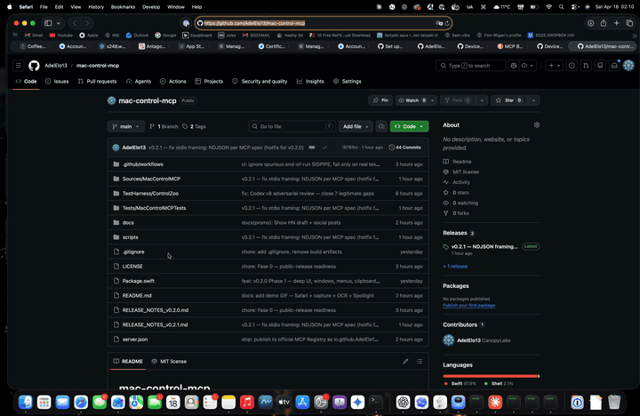

# mac-control-mcp

[](https://github.com/AdelElo13/mac-control-mcp/actions/workflows/ci.yml)
[](LICENSE)
[](#install)
[](#install)
[](https://registry.modelcontextprotocol.io/)

Native Swift MCP server for full macOS automation. 63 tools in one signed `.app` bundle — no Python, no Node runtime, no Electron.

<p align="center">
  
</p>

Gives any MCP-compatible client (Claude Desktop, Claude Code, Cursor, etc.) the ability to:

- Read and mutate the Accessibility tree of any running app
- Drive Safari and Chrome (tabs, navigation, JS eval)
- Capture the screen, a display, or a specific window (ScreenCaptureKit)
- OCR what's on screen
- Click, type, scroll, drag, send key events
- Control windows (move / resize / fullscreen / minimize / main)
- Manage the clipboard
- Launch / activate / quit apps
- Search Spotlight's index (NSMetadataQuery) and launch results
- Toggle dark mode, volume, list displays, inspect menus

## Install

Requires macOS 14.0+. Three options, in order of simplicity:

### 1. One-click install (Claude Desktop, recommended)

The server is published as an [MCP Bundle](https://github.com/anthropics/mcpb) — a zip with a `manifest.json` that Claude Desktop reads directly:

1. Download [**mac-control-mcp-v0.2.3.mcpb**](https://github.com/AdelElo13/mac-control-mcp/releases/download/v0.2.3/mac-control-mcp-v0.2.3.mcpb) from the release page.
2. Double-click the `.mcpb` file. Claude Desktop opens an install dialog.
3. Click Install. The server is registered under the name `mac-control-mcp` and available immediately in new chats.
4. First tool call triggers the macOS TCC consent prompts (Screen Recording, Accessibility, Apple Events). Grant all three once — the bundle is Developer-ID signed and notarized, so grants persist across updates.

It's also listed on the [official MCP Registry](https://registry.modelcontextprotocol.io/) as `io.github.AdelElo13/mac-control-mcp`, so any MCP client that supports the registry will find it by searching for "mac-control".

### 2. Download the prebuilt app

If you don't use Claude Desktop or want manual control:

1. Download [**MacControlMCP-v0.2.3-macos-universal.tar.gz**](https://github.com/AdelElo13/mac-control-mcp/releases/download/v0.2.3/MacControlMCP-v0.2.3-macos-universal.tar.gz).
2. Extract and move `MacControlMCP.app` to `~/Applications/`.
3. Point your MCP client at the binary inside:

```json
{
  "mcpServers": {
    "mac-control-mcp": {
      "type": "stdio",
      "command": "/Users/you/Applications/MacControlMCP.app/Contents/MacOS/MacControlMCP"
    }
  }
}
```

Add that block to `~/Library/Application Support/Claude/claude_desktop_config.json` (Claude Desktop) or `~/.claude.json` → `mcpServers` (Claude Code).

Verify the download with the published SHA-256:

```bash
shasum -a 256 MacControlMCP-v0.2.3-macos-universal.tar.gz
# should match MacControlMCP-v0.2.3-macos-universal.sha256 on the release
```

### 3. Build from source

For contributors or if you want to tweak the code. Requires Swift 6 / Xcode 16+:

```bash
git clone https://github.com/AdelElo13/mac-control-mcp.git
cd mac-control-mcp
./scripts/build-bundle.sh
```

Produces `~/Applications/MacControlMCP.app/Contents/MacOS/MacControlMCP`. Without a Developer ID cert in your keychain it'll fall back to ad-hoc signing (works for local use, TCC grants reset on every rebuild).

To re-sign + re-notarise an existing Apple Developer account:

```bash
# one-time: store notary credentials in keychain
xcrun notarytool store-credentials "mac-control-mcp" \
    --apple-id "you@example.com" --team-id "XXXXXXXXXX"

# subsequent builds:
NOTARIZE_PROFILE=mac-control-mcp ./scripts/build-bundle.sh
```

## Tool surface

| Category | Tools |
|---|---|
| Permissions | `permissions_status`, `request_permissions` |
| Accessibility | `find_element(s)`, `query_elements`, `list_elements`, `get_ui_tree`, `get_element_attributes`, `set_element_attribute`, `read_value`, `perform_element_action`, `wait_for_element`, `scroll_to_element` |
| App lifecycle | `list_apps`, `launch_app`, `activate_app`, `quit_app`, `force_quit_app`, `wait_for_app`, `focused_app` |
| Windows | `list_windows`, `focus_window`, `move_window`, `resize_window`, `set_window_state`, `wait_for_window`, `move_window_to_display` |
| Input | `click`, `mouse_event`, `drag_and_drop`, `scroll`, `type_text`, `press_key`, `press_key_sequence`, `key_down`, `key_up`, `convert_coordinates` |
| Menus | `click_menu_path`, `list_menu_paths`, `list_menu_titles` |
| Browser | `browser_list_tabs`, `browser_get_active_tab`, `browser_navigate`, `browser_new_tab`, `browser_close_tab`, `browser_eval_js` |
| Screen | `capture_screen`, `capture_window`, `capture_display`, `ocr_screen` |
| Clipboard | `clipboard_read`, `clipboard_write`, `clipboard_clear` |
| Spotlight | `spotlight_search`, `spotlight_open_result` |
| System | `set_volume`, `set_dark_mode`, `list_displays` |
| File dialogs | `file_dialog_set_path`, `file_dialog_select_item`, `file_dialog_confirm`, `file_dialog_cancel`, `wait_for_file_dialog` |

Total: **63 tools**.

## Security model

- Tools that write files (`capture_*`, `ocr_screen`) validate `output_path` via a strict allow-list — only the user-scoped temp dir (`NSTemporaryDirectory()`) and `~/Desktop`, `~/Documents`, `~/Downloads`, `~/Pictures` are accepted. Symlinks at the target path are rejected to prevent redirection. `/tmp` is deliberately excluded because it's shared across users and opens a TOCTOU window.
- AppleScript string interpolation for `browser_eval_js` wraps user code in `(0, eval)(…)` via `JSON.stringify`, so quotes/newlines/unicode can't break out of the wrapper.
- No network calls. Everything is local system integration.

## Status (verified in the current release)

| Scope | State |
|---|---|
| Unit / integration test suite | 63 tests in 11 suites, all green locally and on CI (macos-15) |
| Live tool probe | 43 of the 63 tools exercised end-to-end via real MCP stdio against the running binary, all pass |
| Destructive tools (volume, dark mode, force_quit_app, drag_and_drop, file_dialog_*) | Verified live in a reversible way |
| Code signing | Developer ID Application (A3W973JZ49) with hardened runtime |
| Apple notarization | Accepted by Apple Notary Service, ticket stapled, `spctl` reports `source=Notarized Developer ID` |
| Gatekeeper flow | Extracted + launched with the `com.apple.quarantine` xattr set; no right-click-open needed |
| MCP Registry | Published as `io.github.AdelElo13/mac-control-mcp` v0.2.3 — distributed as an `.mcpb` bundle for one-click install |
| Architectures | Universal binary (arm64 + x86_64). Intel slice compiles cleanly but has not been runtime-verified on actual Intel hardware |
| `move_window_to_display` | Skipped — requires a 2+ display setup |

If you run into an untested path, please open an issue with the reproduction — happy to fix fast.

## Caveats

- **Cross-origin iframes** block `browser_eval_js` — same-origin policy, not a limitation of the tool. Use AX coords or synthetic CGEvents for content inside embedded iframes from other origins.
- **First-run TCC prompts are unavoidable.** macOS requires the user to grant Screen Recording, Accessibility and Apple Events the first time. The usage-description strings in `Info.plist` make the consent dialogs show up with a clear reason, but you still need to click Allow in System Settings once.

## Development

```bash
# Run the test suite (63 tests in 11 suites)
swift test

# Build without packaging
swift build -c release

# Live probe the running binary via MCP stdio
python3 scripts/mcp-sweep.py  # if included
```

## License

MIT — see [LICENSE](LICENSE).

## Contributing

Issues and pull requests welcome. Adversarial reviews especially — prior releases went through 11 rounds of external review before shipping.
