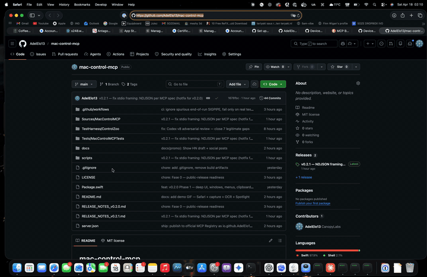

# mac-control-mcp

[](https://github.com/AdelElo13/mac-control-mcp/actions/workflows/ci.yml)
[](LICENSE)
[](#install)
[](#install)
[](https://registry.modelcontextprotocol.io/)

Native Swift MCP server for full macOS automation. <!-- tool-count -->151<!-- /tool-count --> tools in one signed `.app` bundle — no Python, no Node runtime, no Electron. Full list with parameters: [docs/TOOLS.md](docs/TOOLS.md).

<p align="center">
  
</p>

Gives any MCP-compatible client (Claude Desktop, Claude Code, Cursor, etc.) the ability to:

- Read and mutate the Accessibility tree of any running app
- Drive Safari and Chrome (tabs, navigation, JS eval)
- Capture the screen, a display, or a specific window (ScreenCaptureKit)
- OCR what's on screen
- Click, type, scroll, drag, send key events
- Control windows (move / resize / fullscreen / minimize / main)
- Manage the clipboard
- Launch / activate / quit apps
- Search Spotlight's index (NSMetadataQuery) and launch results
- Toggle dark mode, volume, list displays, inspect menus

## Install

Requires macOS 14.0+. Four options, in order of simplicity:

### 1. One-click install (Claude Desktop, recommended)

The server is published as an [MCP Bundle](https://github.com/anthropics/mcpb) — a zip with a `manifest.json` that Claude Desktop reads directly:

1. Download **mac-control-mcp-v\<version\>.mcpb** from the [latest release](https://github.com/AdelElo13/mac-control-mcp/releases/latest).
2. Double-click the `.mcpb` file. Claude Desktop opens an install dialog.
3. Click Install. The server is registered under the name `mac-control-mcp` and available immediately in new chats.
4. First tool call triggers the macOS TCC consent prompts (Screen Recording, Accessibility, Apple Events). Grant all three once — the bundle is Developer-ID signed and notarized, so grants persist across updates.

It's also listed on the [official MCP Registry](https://registry.modelcontextprotocol.io/) as `io.github.AdelElo13/mac-control-mcp`, so any MCP client that supports the registry will find it by searching for "mac-control".

### 2. Install via npm / npx

For clients that are configured with a command line rather than a file path. The npm package [`mac-control-mcp`](https://www.npmjs.com/package/mac-control-mcp) is a thin launcher: it has no runtime dependencies, and on install it downloads the notarized `MacControlMCP.app` for that exact version from this repo's GitHub release, verifies it against the published `.sha256`, refuses any archive entry that escapes the install directory, and re-checks the bundle with `codesign --verify --deep --strict`, `spctl --assess --type execute` and a pinned Team ID (`A3W973JZ49`). The first run therefore pulls ~3 MB; later runs are local.

Claude Desktop — `~/Library/Application Support/Claude/claude_desktop_config.json`:

```json
{
  "mcpServers": {
    "mac-control-mcp": {
      "command": "npx",
      "args": ["-y", "mac-control-mcp"]
    }
  }
}
```

Claude Code:

```bash
claude mcp add mac-control-mcp -- npx -y mac-control-mcp
```

Cursor — `~/.cursor/mcp.json`:

```json
{
  "mcpServers": {
    "mac-control-mcp": {
      "command": "npx",
      "args": ["-y", "mac-control-mcp"]
    }
  }
}
```

ChatGPT (developer mode, local MCP connector) — `mcp.json`:

```json
{
  "mcpServers": {
    "mac-control-mcp": {
      "command": "npx",
      "args": ["-y", "mac-control-mcp"],
      "transport": "stdio"
    }
  }
}
```

Two flags are handled by the launcher itself instead of being forwarded to the binary:

```bash
npx -y mac-control-mcp --version    # version of the bundled .app
npx -y mac-control-mcp --app-path   # path to MacControlMCP.app
```

`--app-path` is what you need when granting macOS permissions by hand. Note that TCC grants go to the **MCP host application** that launches this process (Claude Desktop, Cursor, your terminal), not to `npx` or to the script — run the [`permissions_status`](docs/TOOLS.md) tool once from your client to see which grants are missing and which app they belong to.

`MAC_CONTROL_MCP_SKIP_DOWNLOAD=1` skips the download (CI, sandboxed builds); `HTTPS_PROXY` and `NO_PROXY` are honoured.

### 3. Download the prebuilt app

If you don't use Claude Desktop or want manual control:

1. Download **MacControlMCP-v\<version\>-macos-universal.tar.gz** from the [latest release](https://github.com/AdelElo13/mac-control-mcp/releases/latest).
2. Extract and move `MacControlMCP.app` to `~/Applications/`.
3. Point your MCP client at the binary inside:

```json
{
  "mcpServers": {
    "mac-control-mcp": {
      "type": "stdio",
      "command": "/Users/you/Applications/MacControlMCP.app/Contents/MacOS/MacControlMCP"
    }
  }
}
```

Add that block to `~/Library/Application Support/Claude/claude_desktop_config.json` (Claude Desktop) or `~/.claude.json` → `mcpServers` (Claude Code).

Verify the download with the published SHA-256:

```bash
shasum -a 256 MacControlMCP-v<version>-macos-universal.tar.gz
# should match MacControlMCP-v<version>-macos-universal.sha256 on the release
```

### 4. Build from source

For contributors or if you want to tweak the code. Requires Swift 6 / Xcode 16+:

```bash
git clone https://github.com/AdelElo13/mac-control-mcp.git
cd mac-control-mcp
./scripts/build-bundle.sh
```

Produces `~/Applications/MacControlMCP.app/Contents/MacOS/MacControlMCP`. Without a Developer ID cert in your keychain it'll fall back to ad-hoc signing (works for local use, TCC grants reset on every rebuild).

To re-sign + re-notarise an existing Apple Developer account:

```bash
# one-time: store notary credentials in keychain
xcrun notarytool store-credentials "mac-control-mcp" \
    --apple-id "you@example.com" --team-id "XXXXXXXXXX"

# subsequent builds:
NOTARIZE_PROFILE=mac-control-mcp ./scripts/build-bundle.sh
```

## Tool surface

Selected categories — this table is a curated subset, not the full list.
For the complete, auto-generated tool reference (every tool, its
description, and its required/optional parameters, regenerated straight
from the tool registry so it can't drift), see **[docs/TOOLS.md](docs/TOOLS.md)**.

| Category | Tools |
|---|---|
| Permissions | `permissions_status`, `request_permissions` |
| Accessibility | `find_element(s)`, `query_elements`, `list_elements`, `get_ui_tree`, `ax_tree_augmented`, `get_element_attributes`, `set_element_attribute`, `read_value`, `perform_element_action`, `wait_for_element`, `scroll_to_element` |
| App lifecycle | `list_apps`, `launch_app`, `activate_app`, `quit_app`, `force_quit_app`, `wait_for_app`, `focused_app` |
| Windows | `list_windows`, `focus_window`, `move_window`, `resize_window`, `set_window_state`, `wait_for_window`, `move_window_to_display` |
| Input | `click`, `mouse_event`, `drag_and_drop`, `scroll`, `type_text`, `press_key`, `press_key_sequence`, `key_down`, `key_up`, `convert_coordinates` |
| Menus | `click_menu_path`, `list_menu_paths`, `list_menu_titles` |
| Browser | `browser_list_tabs`, `browser_get_active_tab`, `browser_navigate`, `browser_new_tab`, `browser_close_tab`, `browser_eval_js`, `browser_dom_tree`, `browser_visible_text`, `browser_iframes` |
| Screen | `capture_screen`, `capture_screen_v2`, `capture_window`, `capture_display`, `ocr_screen` |
| Clipboard | `clipboard_read`, `clipboard_write`, `clipboard_clear` |
| Spotlight | `spotlight_search`, `spotlight_open_result` |
| System | `set_volume`, `set_dark_mode`, `list_displays` |
| File dialogs | `file_dialog_set_path`, `file_dialog_select_item`, `file_dialog_confirm`, `file_dialog_cancel`, `wait_for_file_dialog` |
| Apple apps | `mail_send`, `imessage_send`, `imessage_list_recent`, `calendar_create_event`, `calendar_list_events`, `reminders_create`, `reminders_list`, `contacts_search` |
| Voice & recording | `speech_to_text`, `text_to_speech`, `audio_record`, `record_screen` |
| Undo | `undo_last_action`, `undo_peek` |

<!-- tool-count -->151<!-- /tool-count --> tools total — see [docs/TOOLS.md](docs/TOOLS.md) for the complete, generated list.

### Which tool when

Several tools overlap in purpose. Based on their actual implementations:

**Screen capture — `capture_screen` vs `capture_screen_v2` vs `capture_window` vs `capture_display`**

- `capture_screen` — main display (or a rectangular region within it) to a PNG file, returns the file path + width/height. Simple, synchronous, no size limits applied.
- `capture_screen_v2` — main display only, but stores the PNG as a content-addressed artifact under `~/.mac-control-mcp/artifacts/<sha256>.png` and returns `{content_ref, bytes, sha256}`. Defaults to `inline=false` and downscales to `max_dimension`/`max_bytes` (4000px / 4MB by default) specifically to avoid blowing up an MCP client's context window with a huge inline image (referenced in its own description as a fix for claude-code issues #13383/#45785). Prefer this one when the image is going back through an LLM context rather than straight to disk.
- `capture_window` — screenshots one specific window by PID (optionally filtered by `title_contains`), not the whole display.
- `capture_display` — screenshots one specific physical display by its index from `list_displays`, for multi-monitor setups.

**Accessibility tree / element lookup — `find_element` vs `find_elements` vs `query_elements` vs `list_elements` vs `get_ui_tree` vs `ax_tree_augmented`**

- `list_elements` — lists actionable elements for a PID (a flat, practical "what can I click" view).
- `find_element` — returns the *first* element matching a role/title filter for a PID.
- `find_elements` — same matching as `find_element`, but returns *all* matches, not just the first.
- `query_elements` — regex search over role/title/value (falls back to case-insensitive substring on invalid regex); use when a plain role/title filter isn't precise enough.
- `get_ui_tree` — walks the *full* accessibility tree of a process, including containers, and assigns stable element IDs for follow-up calls. Heavier than `list_elements`/`find_element(s)`, but the only one that gives you structure/hierarchy.
- `ax_tree_augmented` — like `get_ui_tree`, but does one OCR pass and geometrically joins OCR-derived labels onto AX nodes that have no native label. Use it specifically for Electron/Chromium/Canvas apps where the native AX tree is sparse and unlabeled; it's the expensive option (an OCR pass), so reach for `get_ui_tree` first and fall back to this when nodes come back unlabeled.

## Security model

- Tools that write files (`capture_*`, `ocr_screen`) validate `output_path` via a strict allow-list — only the user-scoped temp dir (`NSTemporaryDirectory()`) and `~/Desktop`, `~/Documents`, `~/Downloads`, `~/Pictures` are accepted. Symlinks at the target path are rejected to prevent redirection. `/tmp` is deliberately excluded because it's shared across users and opens a TOCTOU window.
- AppleScript string interpolation for `browser_eval_js` wraps user code in `(0, eval)(…)` via `JSON.stringify`, so quotes/newlines/unicode can't break out of the wrapper.
- No network calls. Everything is local system integration.

## Status (verified in the current release)

| Scope | State |
|---|---|
| Unit / integration test suite | `swift test`, all green locally and on CI (macos-15) — see [ci.yml](.github/workflows/ci.yml) |
| Live tool probe | A subset of tools exercised end-to-end via real MCP stdio against the running binary, all pass |
| Destructive tools (volume, dark mode, force_quit_app, drag_and_drop, file_dialog_*) | Verified live in a reversible way |
| Code signing | Developer ID Application (A3W973JZ49) with hardened runtime |
| Apple notarization | Accepted by Apple Notary Service, ticket stapled, `spctl` reports `source=Notarized Developer ID` |
| Gatekeeper flow | Extracted + launched with the `com.apple.quarantine` xattr set; no right-click-open needed |
| MCP Registry | Published as `io.github.AdelElo13/mac-control-mcp` (see `server.json` for the current version) — distributed as an `.mcpb` bundle for one-click install |
| Architectures | Universal binary (arm64 + x86_64). Intel slice compiles cleanly but has not been runtime-verified on actual Intel hardware |
| `move_window_to_display` | Skipped — requires a 2+ display setup |

If you run into an untested path, please open an issue with the reproduction — happy to fix fast.

## Caveats

- **Cross-origin iframes** block `browser_eval_js` — same-origin policy, not a limitation of the tool. Use AX coords or synthetic CGEvents for content inside embedded iframes from other origins.
- **First-run TCC prompts are unavoidable.** macOS requires the user to grant Screen Recording, Accessibility and Apple Events the first time. The usage-description strings in `Info.plist` make the consent dialogs show up with a clear reason, but you still need to click Allow in System Settings once.

## Development

```bash
# Run the test suite
swift test

# Build without packaging
swift build -c release

# Live probe the running binary via MCP stdio
python3 scripts/mcp-sweep.py  # if included
```

## License

MIT — see [LICENSE](LICENSE).

## Contributing

Issues and pull requests welcome. Adversarial reviews especially — prior releases went through 11 rounds of external review before shipping.
